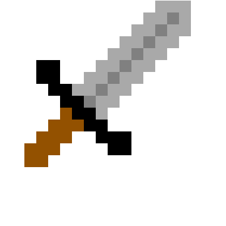

# drawsomething

[Demo](https://www.johnmilley.com/drawsomething/)

## Why did I make this?

This app was developed haphazardly in an attempt to learn something about HTML canvas. It ended up being a little project that my kids enjoyed drawing with.

Features:

* **fill** draws a pixel in each grid box of the currently selected color
* **grid** toggles the grid on/off
* **join** will remove the grid lines and extend each pixel a little to make a continuous shape
* **break** reverses the join
* **clear** clears the grid
* **undo** removes the last place pixel with an empty pixel
* **save** downloads your artwork as a png

## Art Gallery

### baby dino

### underwater volcano

### sword

### the house on fire

